# Aleo Integration — Mermaid Diagrams

PrivatePay’s Aleo integration: component topology, user flows, Leo programs, and privacy model.  
**Resources:** [Aleo Developer Docs](https://developer.aleo.org/) · [Leo Language](https://docs.leo-lang.org/leo) · [Leo Playground](https://play.leo-lang.org/) · [Aleo.org](https://aleo.org/)

---

## 1. Component topology

```mermaid
flowchart LR
  subgraph Browser[User Browser]
    REACT[React App<br/>Vite + Router]
    ALEO_PAGE[AleoPage.jsx<br/>/aleo]
    CREDIT[AleoCreditPage<br/>/aleo/credit]
    LENDING[AleoLendingPage<br/>/aleo/lending]
    DARKPOOL[AleoDarkPoolPage<br/>/aleo/darkpool]
    AMM[AleoAMMPage<br/>/aleo/amm]
    VAULTS[AleoVaultsPage<br/>/aleo/vaults]
    TREASURY[AleoTreasuryPage<br/>/aleo/treasury]
    ALEO_PROVIDER[AleoProvider.jsx<br/>Leo Wallet Adapter]
    LIB[src/lib/aleo/<br/>credit, lending, darkpool, amm,<br/>treasury, compliance, sdk]
  end

  subgraph Wallet[Wallet]
    LEO[Leo Wallet<br/>Testnet Beta]
  end

  subgraph AleoNetwork[Aleo Network]
    RPC[Aleo RPC / Provable API]
    ZK[zk_credit.aleo]
    LEND[private_lending.aleo]
    DP[dark_pool.aleo]
    SAMM[shielded_amm.aleo]
    VAULT[cross_chain_vault.aleo]
    TM[treasury_management.aleo]
    COMP[compliance_module.aleo]
  end

  REACT --> ALEO_PROVIDER
  ALEO_PROVIDER --> ALEO_PAGE
  ALEO_PROVIDER --> CREDIT
  ALEO_PROVIDER --> LENDING
  ALEO_PROVIDER --> DARKPOOL
  ALEO_PROVIDER --> AMM
  ALEO_PROVIDER --> VAULTS
  ALEO_PROVIDER --> TREASURY

  ALEO_PAGE --> LIB
  CREDIT --> LIB
  LENDING --> LIB
  DARKPOOL --> LIB
  AMM --> LIB
  VAULTS --> LIB
  TREASURY --> LIB

  CREDIT -->|requestTransaction| LEO
  LENDING -->|requestTransaction| LEO
  DARKPOOL -->|requestTransaction| LEO
  AMM -->|requestTransaction| LEO
  VAULTS -->|requestTransaction| LEO
  TREASURY -->|requestTransaction| LEO
  ALEO_PAGE -->|requestTransaction| LEO

  LEO -->|sign & submit| RPC
  RPC --> ZK
  RPC --> LEND
  RPC --> DP
  RPC --> SAMM
  RPC --> VAULT
  RPC --> TM
  RPC --> COMP
```

---

## 2. User flow: connect wallet and private transfer

---

## 3. ZK Credit flow: verify creditworthiness and issue loan

---

## 4. Dark pool flow: place and cancel order

---

## 5. Leo programs and data flow

---

## 6. Privacy model: encrypted state and ZK

---

## 7. Build and deploy flow

---

## 8. Aleo resources (quick links)

| Resource        | URL |
|----------------|-----|
| Aleo Developer Docs | https://developer.aleo.org/ |
| Leo Language   | https://docs.leo-lang.org/leo |
| Leo Playground | https://play.leo-lang.org/ |
| Aleo.org       | https://aleo.org/ |
| Testnet Faucet | https://faucet.aleo.org |

---

*See also: [docs/ALEO_ARCHITECTURE.md](docs/ALEO_ARCHITECTURE.md), [docs/ALEO_PRIVACY_MODEL.md](docs/ALEO_PRIVACY_MODEL.md), [ALEO_BUILDATHON_ALIGNMENT.md](ALEO_BUILDATHON_ALIGNMENT.md).*
