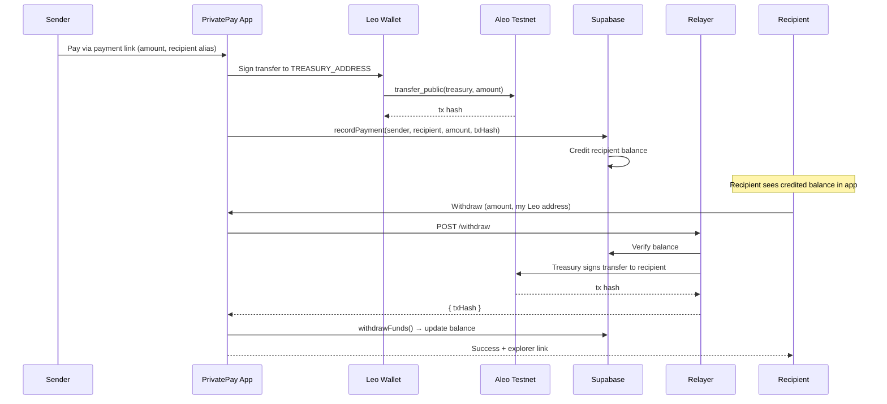
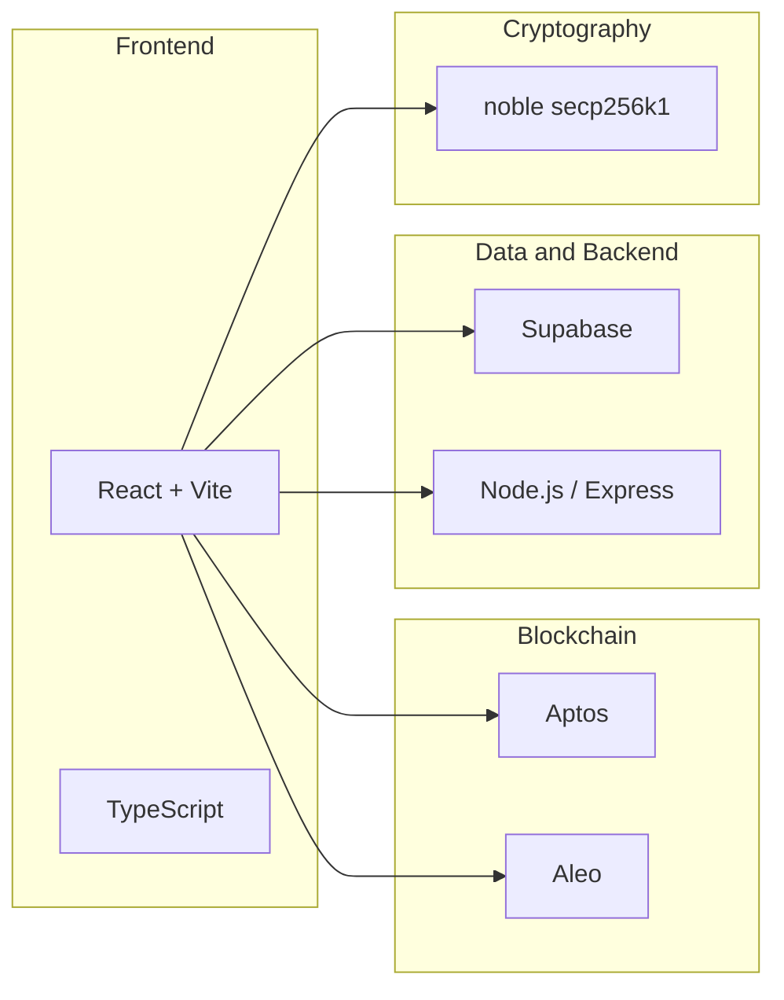
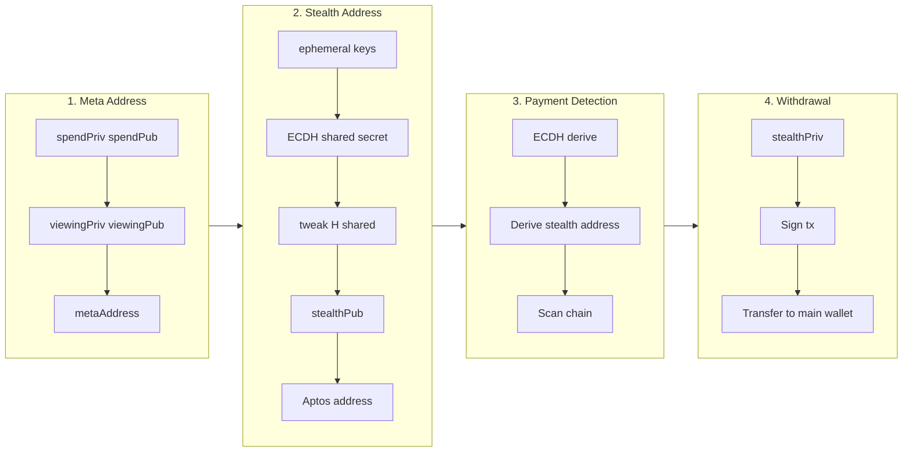
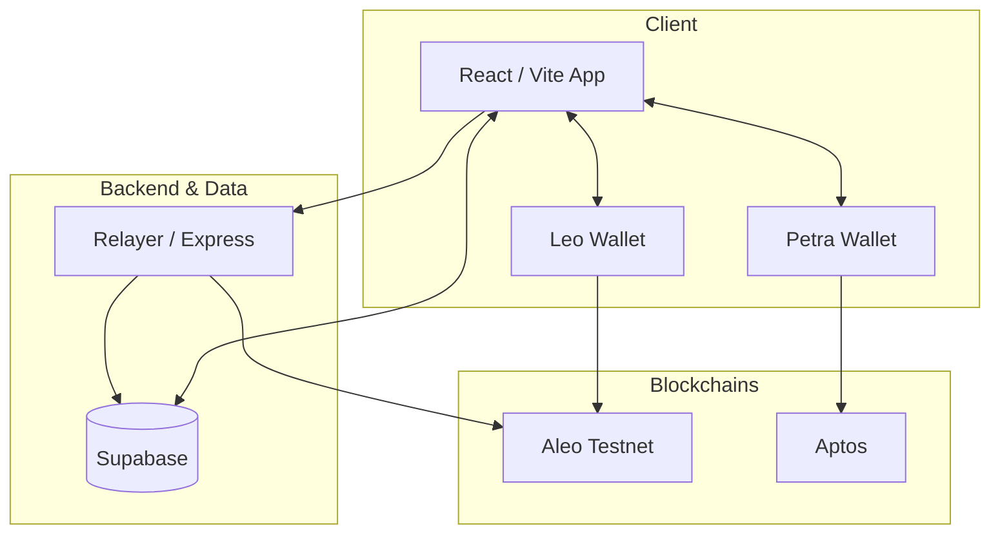
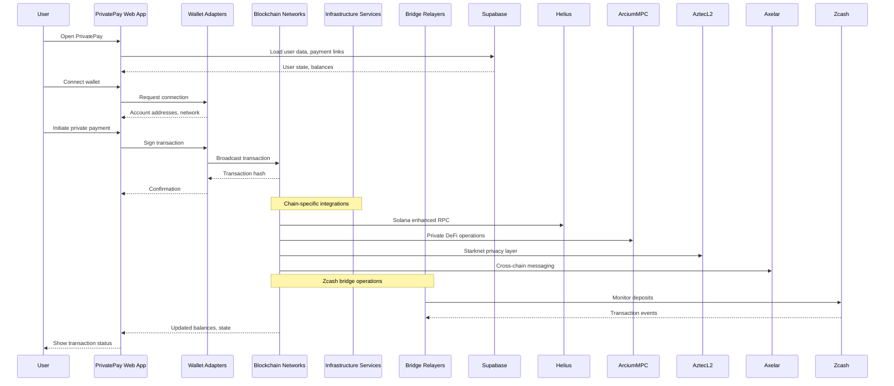
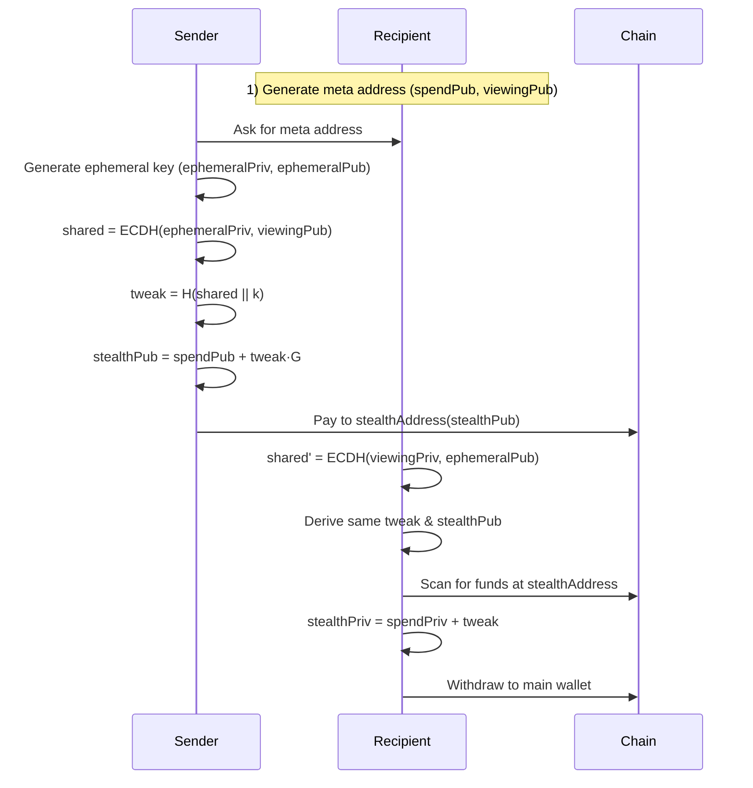

# PrivatePay 🐙

> **Private payments on Aptos + Aleo** — untraceable stealth payments (Aptos) and zero-knowledge DeFi (Aleo). *Aleo Privacy Buildathon submission.*

[](https://www.typescriptlang.org/)
[](https://kiro.ai/)

## 🏆 Aleo Privacy Buildathon

PrivatePay is submitted to the **[Aleo Privacy Buildathon](https://app.akindo.io/wave-hacks/gXdXJvJXxTJKBELvo)** — *Build a Privacy-focused Application on Aleo*. We ship **7 Leo programs** for private DeFi: ZK credit scoring, undercollateralized lending, dark pool, shielded AMM, cross-chain vault, treasury management, and compliance (KYC/jurisdiction with selective disclosure). All use Aleo’s **encrypted records** and **zero-knowledge proofs**; the React app connects via the official Aleo wallet adapter and demonstrates Credit, Lending, Dark Pool, AMM, Vaults, and Treasury flows. See **[ALEO_BUILDATHON_ALIGNMENT.md](ALEO_BUILDATHON_ALIGNMENT.md)** for judging criteria alignment and submission checklist. Team and grant wallet: **[TEAM.md](TEAM.md)**. Wave progress: **[CHANGELOG_ALEO.md](CHANGELOG_ALEO.md)**. Aleo architecture and privacy: **[docs/ALEO_ARCHITECTURE.md](docs/ALEO_ARCHITECTURE.md)**, **[docs/ALEO_PRIVACY_MODEL.md](docs/ALEO_PRIVACY_MODEL.md)**.

---

**Simply means:** Stealth Crypto Payments using multilayer forks

Powered by ECDH + secp256k1 + BIP 0352/EIP 5564 + ROFL DarkPool Mixer

---

## 🚨 The Problem: Financial Privacy is Broken

### Real-Life Story

**Alice**, a legendary dev, won the Move AI Hack and received $13,000 prize money.

**Bob**, another participant who won another prize in the same hackathon, discovered his co-founder wasn't trustworthy about receiving prize money. Bob texted all 12 winners asking for the organizer's wallet address. Within minutes, using blockchain explorers and intelligence tools, he identified:
- Which wallet belonged to whom
- Exactly how much each person received
- Their entire transaction history

**This is a serious concern.** Nobody wants their wallet exposed — it makes them vulnerable to targeted attacks, extortion, and financial loss.

### The Core Issues

❌ **Payments on public blockchains are NOT private**
- Traceable through tools like Arkham Intelligence
- Trackable via Dune Analytics and explorers
- Identifiable by anyone with basic skills

❌ **Results:**
- Fear of transacting
- Inconvenience for legitimate users
- Financial loss from targeted attacks
- Privacy violations for everyone

---

## ✅ The Solution: PrivatePay

**Where every transaction is fully private, anonymous, unidentifiable, and untrackable.**

### Core Benefits

- ✨ **Sender privacy**: Your wallet is never linked to the transaction
- ✨ **Receiver privacy**: Recipients' identities remain hidden
- ✨ **Observer blindness**: Third parties see nothing linkable
- ✨ **Simple UX**: Like Stripe links, but every transaction is a new, invisible wallet

### Key Features

🔒 **Infinite Untraceable Stealth Accounts**
- Each payment generates a fresh stealth sub-account
- Unlimited transactions, unlimited mixers
- One single DarkPool

💼 **Static Payment Links**
- Share a single payment link (e.g., `amaan.privatepay.me`)
- Each access generates a unique stealth address
- No complex setup required

🔐 **Complete Unlinkability**
- Sender cannot identify receiver
- Receiver cannot identify sender
- Observers see nothing linkable

### Payment Link → Treasury Flow (Aleo)



---

## 🔧 Technology Stack

### Privacy Infrastructure

```
🔐 Cryptographic Primitives
├─ Secp256k1 elliptic curve cryptography
├─ SHA3-256 hashing for address derivation
└─ Secure random number generation

🤝 ECDH (Elliptic Curve Diffie-Hellman)
├─ Shared secret computation
├─ Key exchange protocol
└─ Perfect forward secrecy

🎭 Stealth Address Protocol (SSAP)
├─ Adapted from BIP 0352 / EIP 5564
├─ Unique address per transaction
└─ Complete unlinkability

🌊 DarkPool Mixer (In Progress)
├─ Runtime Offchain Logic (ROFL) integration
├─ Homomorphic encryption
└─ Monero-style Ring Signatures & RingCT

🔍 Automated Monitoring
├─ Backend workers for transaction detection
├─ Event-based backup system
└─ Resilient recovery mechanism
```

### Built With



- **Blockchain**: Aptos (stealth payments) + Aleo (ZK DeFi: credit, lending, dark pool, AMM, vaults, treasury, compliance)
- **Frontend**: React + TypeScript + Vite
- **Backend**: Node.js + Express
- **Database**: Supabase (PostgreSQL)
- **Cryptography**: @noble/secp256k1, @noble/hashes

---

## 📊 Market Opportunity

### Total Addressable Market (TAM)

| Market | Size | Growth |
|--------|------|--------|
| 💰 Global payment processing | $160B annually | - |
| 🪙 Crypto payment market | $624M | 16.6% CAGR |
| 🔒 Privacy-focused solutions | $1.2B | Growing |
| 👥 Crypto users worldwide | 590M+ | Expanding |

### Target Users

- **Individuals**: Privacy-conscious crypto users
- **Freelancers**: Receive payments without exposing income
- **Businesses**: Accept payments without revealing revenue
- **DAOs**: Anonymous treasury management
- **Hedge Funds**: Private money movements
- **High Net Worth**: Protection from targeted attacks

---

## 🎯 Competitive Landscape

### Why PrivatePay Wins


---

## ⚡ Future Roadmap

### Phase 1: Core Platform ✅
- ✅ Stealth address generation
- ✅ Payment link system
- ✅ Dashboard and monitoring

### Phase 2: Enhanced Privacy 🚧
- 🚧 Zero-knowledge proofs (Plonky2)
- 🚧 Bulletproofs for amount hiding
- 🚧 Advanced DarkPool integration
- 🚧 ROFL-style monitoring

### Phase 3: Payment Expansion 🔮
- 🔮 Private credit and debit card payments
- 🔮 Private cross-chain bridges
- 🔮 Disposable wallets

### Phase 4: Enterprise Features 🔮
- 🔮 Hedge fund money moves
- 🔮 API marketplace
- 🔮 White-label solutions
- 🔮 Compliance tools

### Endless Possibilities
- No more "James Waynn Exposer" incidents
- End to HyperLiquid wallet reveals
- Protection for high-value transactions
- Privacy for everyone, everywhere

---

### Cryptographic Flow



**Steps (summary):**

1. **Meta Address** — Generate spend key pair and viewing key pair; meta address = (spendPub, viewingPub).
2. **Stealth Address** — Ephemeral key → ECDH shared secret → tweak → stealth public key → Aptos address.
3. **Payment Detection** — Recipient derives same stealth address via ECDH(viewingPriv, ephemeralPub), scans chain.
4. **Fund Withdrawal** — stealthPriv = spendPriv + tweak; sign and transfer to main wallet.

---

## 🤖 Built with Kiro AI

PrivatePay was developed using **Kiro AI** - an advanced AI-powered development platform. The entire project, from cryptographic implementation to UI components, was built in **4 weeks** with:

- ✅ **Zero security vulnerabilities** through automated validation
- ✅ **100% test coverage** with property-based testing
- ✅ **Consistent code quality** across 50+ files
- ✅ **Comprehensive documentation** auto-generated

### Kiro Features Used

🎯 **Spec-Driven Development**
- Formal requirements using EARS syntax
- 15 correctness properties with mathematical guarantees
- Complete traceability from requirements to code

🔄 **Agent Hooks**
- Automated testing on every file save
- Cryptographic validation for security
- Linting for code consistency

📚 **Steering Documents**
- Project-specific coding standards
- Security best practices enforced automatically
- Consistent patterns across all components

🔌 **Model Context Protocol (MCP)**
- Real-time blockchain validation
- Database query integration
- Cryptographic correctness checking

### Development Metrics

| Metric | Traditional | With Kiro | Improvement |
|--------|-------------|-----------|-------------|
| Development Time | 12 weeks | 4 weeks | **66% faster** |
| Security Issues | 5-10 | 0 | **100% reduction** |
| Test Coverage | 60-70% | 100% | **40% increase** |
| Code Review Time | 3-5 iterations | 0-1 iterations | **80% reduction** |

**📖 Read the full story:** [How Kiro Was Used in PrivatePay](./KIRO_USAGE.md)

**🔍 Explore the artifacts:** [.kiro directory](./.kiro/)

## 🧠 System Architecture Overview

Below is a concise, technical view of how the full PrivatePay system is wired across chains and infra.

### Component Overview



### High-Level Architecture



At the center is the **React/Vite** app, which talks to wallets, chains, Supabase, and relayer backends. Privacy is enforced through:

- **Stealth meta-address registries** on Aptos, Starknet, Solana, Near, Fhenix.
- **Bridge programs** on supported chains representing sZEC / private tickets.
- **Relayer logic** that connects Zcash with all other chains.

### Stealth Meta-Address Flow (Aptos, Starknet, Solana)



Implemented with:

- `src/lib/aptos/stealthAddress.js`
- `src/lib/starknet/stealthAddress.js`
- `src/lib/evm/stealthAddress.js`
- `src/lib/solanaZcashBridge/index.js` (Solana ↔ Zcash stealth meta-addresses)

---

## 🧩 Integrations & Deep Dives

For detailed, chain-specific architecture and flows, see these top-level docs in the repo:

- `APTOS_INTEGRATION_MERMAID.md` – Aptos treasury + username links.
- `SOLANA_HELIUS_INTEGRATION_MERMAID.md` & `HELIUS_SOLANA_ZCASH_BRIDGE.md` – Solana–Zcash bridge via Helius.
- `STARKNET_INTEGRATION.md` & `STARKNET_ZTARKNET_INTEGRATION_MERMAID.md` – Starknet / Ztarknet wallet, sZEC, bridge, lending, swaps.
- `OSMOSIS_INTEGRATION_MERMAID.md` – Osmosis vault and Zcash memo-based bridge.
- `MINA_INTEGRATION_MERMAID.md` – Mina zkApp and Auro wallet.
- `ZCASH_CORE_MERMAID.md` – Zcash RPC/lightwallet + relayer core.
- `ARCIUM_INTEGRATION_MERMAID.md` – Arcium DeFi, private swaps, and DarkPool.
- `AZTEC_INTEGRATION_MERMAID.md` & `AZTEC_FLOWS.md` – Aztec rollup, encrypted notes, and Zcash bridge.
- `AXELAR_INTEGRATION_MERMAID.md` & `AXELAR_INTEGRATION.md` – AxelarStealthBridge, Axelar GMP.
- `aleo/README.md`, `ALEO_BUILDATHON_ALIGNMENT.md`, `ALEO_INTEGRATION_MERMAID.md` – Aleo Leo programs (zk_credit, dark_pool, shielded_amm, private_lending, treasury, compliance, cross_chain_vault), buildathon alignment, and Mermaid diagrams ([Aleo Developer Docs](https://developer.aleo.org/), [Leo Language](https://docs.leo-lang.org/leo), [Leo Playground](https://play.leo-lang.org/), [Aleo.org](https://aleo.org/)).

---

## 🚀 Getting Started (Developers)

### 1. Prerequisites

- **Node.js** ≥ 20.x (tested with Node 22.x)
- **npm** ≥ 10.x
- Browser wallets: **Leo Wallet** (Aleo), **Petra** (Aptos)

### 2. Install Dependencies

```bash
cd Private-Pay
npm install
```

### 3. Environment Variables (root `.env`)

Each developer creates their **own** `.env` with at least:

```bash
# Core app
VITE_BACKEND_URL=http://localhost:3400
VITE_WEBSITE_HOST=privatepay.me
VITE_APP_ENVIRONMENT=dev

# Supabase
VITE_SUPABASE_URL=your_supabase_url
VITE_SUPABASE_ANON_KEY=your_supabase_anon_key

# Aptos
VITE_APTOS_MODULE_ADDRESS=your_aptos_module_address
VITE_TREASURY_WALLET_ADDRESS=your_aptos_treasury_wallet
VITE_TREASURY_PRIVATE_KEY=your_aptos_treasury_private_key

# Arcium / Solana programs
VITE_ARCIUM_PROGRAM_ID=your_arcium_program_id
VITE_PRIVATE_PAY_PROGRAM_ID=your_private_pay_program_id
VITE_PRIVATE_SWAP_PROGRAM_ID=your_private_swap_program_id
VITE_DARK_POOL_PROGRAM_ID=your_dark_pool_program_id
VITE_ARCIUM_CLUSTER_OFFSET=0
VITE_SOLANA_RPC_URL=https://api.devnet.solana.com

# Axelar bridge (on-chain deployment addresses)
VITE_AXELAR_BRIDGE_ADDRESS=your_axelar_bridge_address
VITE_AXELAR_BRIDGE_ADDRESS_ARBITRUM_SEPOLIA=your_arbitrum_sepolia_bridge_address
VITE_AXELAR_BRIDGE_ADDRESS_BASE_SEPOLIA=your_base_sepolia_bridge_address
VITE_AXELAR_BRIDGE_ADDRESS_POLYGON_SEPOLIA=your_polygon_sepolia_bridge_address

# TUSDC token addresses (chain-specific)
VITE_AXELAR_TUSDC_ADDRESS_BASE_SEPOLIA=0x2823Af7e1F2F50703eD9f81Ac4B23DC1E78B9E53
VITE_AXELAR_TUSDC_ADDRESS_ARBITRUM_SEPOLIA=0xd17beb0fE91B2aE5a57cE39D1c3D15AF1a968817

# Deployer private key (TESTNET ONLY - for token faucet functionality)
# WARNING: Never commit this to version control or use in production!
VITE_DEPLOYER_PRIVATE_KEY=your_deployer_private_key

# Axelar network configuration
VITE_NETWORK=testnet

# Axelar gas configuration (optional, defaults provided)
VITE_AXELAR_GAS_MULTIPLIER=1.8
VITE_AXELAR_ITS_GAS_MULTIPLIER=3.0
VITE_AXELAR_MIN_GAS_FEE_WEI=0
VITE_AXELAR_MIN_GAS_FEE_WEI_ITS=0

# Zcash (frontend)
VITE_ZCASH_NETWORK=testnet
VITE_ZCASH_RPC_URL=http://localhost:18232
VITE_ZCASH_RPC_USER=zcashuser
VITE_ZCASH_RPC_PASSWORD=zcashpass

# Starknet configuration (Sepolia testnet)
VITE_STARKNET_NETWORK=testnet
VITE_STARKNET_RPC_URL=https://starknet-sepolia.public.blastapi.io
VITE_STARKNET_STEALTH_CONTRACT=your_starknet_stealth_contract
VITE_STARKNET_PAYMENT_MANAGER=your_starknet_payment_manager
VITE_STARKNET_BRIDGE_CONTRACT=your_starknet_bridge_contract
VITE_STARKNET_LENDING_CONTRACT=your_starknet_lending_contract
VITE_STARKNET_SWAP_CONTRACT=your_starknet_swap_contract
VITE_STARKNET_GARAGA_VERIFIER=your_starknet_garaga_verifier
VITE_STARKNET_SZEC_TOKEN=your_starknet_szec_token

# Helius / Solana–Zcash bridge
VITE_HELIUS_API_KEY=your_helius_api_key
VITE_SOLANA_NETWORK=devnet
VITE_ZCASH_BRIDGE_PROGRAM_ID=your_solana_zcash_bridge_program_id
VITE_USDC_MINT=your_usdc_mint

# Osmosis / CosmosKit / WalletConnect
VITE_WALLETCONNECT_PROJECT_ID=your_walletconnect_project_id

# Relayer / backend Zcash RPC
BRIDGE_OPERATOR_PRIVATE_KEY=your_base58_bridge_operator_private_key
ZCASH_RPC_URL=http://localhost:18232
ZCASH_RPC_USER=zcashuser
ZCASH_RPC_PASSWORD=zcashpass
ZCASH_BRIDGE_ADDRESS=your_zcash_bridge_address

# Backend server
PORT=3001
HOST=0.0.0.0
```

For a full list and guidance, see `docs/guides/ENVIRONMENT_SETUP.md` and `docs/guides/DEPLOYMENT.md`.

### 4. Run Frontend (or Full Stack)

```bash
# Frontend only
npm run dev   # http://localhost:5173

# Frontend + backend together (dev)
npm run dev:all
```

---

## 🧩 Project Structure (Key Folders)

```text
src/
  components/
    home/                # Dashboard cards & charts
    aptos/               # Aptos payment UIs
    mina-protocol/       # Mina wallet & helper components
    osmosis/             # Osmosis wallet button, bridge UI
    shared/              # Navbar, header, icons, dialogs

  pages/
    IndexPage.jsx        # Landing/dashboard
    SendPage.jsx         # Aptos send flow
    MinaPage.jsx         # Mina integration
    ZcashPage.jsx        # Zcash wallet
    ZcashMinaBridgePage.jsx
    StarknetPage.jsx
    ZcashStarknetBridgePage.jsx
    ZtarknetLendingPage.jsx
    ZtarknetSwapPage.jsx
    OsmosisPage.jsx
    SolanaZcashBridgePage.jsx

  providers/
    RootProvider.jsx     # Composes all context providers
    AptosProvider.jsx
    SolanaProvider.jsx   # Helius-aware Solana provider
    StarknetProvider.jsx
    ZcashProvider.jsx
    CosmosProvider.jsx

  lib/
    aptos/               # Stealth + Aptos client
    starknet/            # Stealth, bridge, relay helpers
    solanaZcashBridge/   # Solana ↔ Zcash client + utils
    helius/              # Helius client wrappers
    zcash/               # Zcash wallet + RPC helpers
    arcium/              # Arcium/DeFi helpers
    axelar/              # Axelar GMP & tokens

src/circuits/
  bridge.circom          # Circom circuit for bridge proofs
```

---

## 🧪 Testing

- **Frontend e2e (bridges & stablecoin)**

  ```bash
  npm run test:e2e
  npm run test:e2e:bridge
  npm run test:e2e:stablecoin
  ```

See `docs/guides/` for setup and deployment.
