# PrivatePay 🐙

> The first on-chain untraceable, unidentifiable, private payments on Aleo.
Powered by Elliptic Curve Diffie-Hellman (ECDH) + secp256k1 + BIP 0352 / EIP 5564 + ROFL DarkPool Mixer

Simply means “Stealth Crypto Payments using multilayer forks”


[](https://www.typescriptlang.org/)

## 🏆 Aleo Privacy Buildathon

PrivatePay is submitted to the **[Aleo Privacy Buildathon](https://app.akindo.io/wave-hacks/gXdXJvJXxTJKBELvo)** — *Build a Privacy-focused Application on Aleo*. We ship **7 Leo programs** for private DeFi: ZK credit scoring, undercollateralized lending, dark pool, shielded AMM, cross-chain vault, treasury management, and compliance (KYC/jurisdiction with selective disclosure). All use Aleo’s **encrypted records** and **zero-knowledge proofs**; the React app connects via the official Aleo wallet adapter and demonstrates Credit, Lending, Dark Pool, AMM, Vaults, and Treasury flows. See **[ALEO_BUILDATHON_ALIGNMENT.md](ALEO_BUILDATHON_ALIGNMENT.md)** for judging criteria alignment and submission checklist. Team and grant wallet: **[TEAM.md](TEAM.md)**. Wave progress: **[CHANGELOG_ALEO.md](CHANGELOG_ALEO.md)**. Aleo architecture and privacy: **[docs/ALEO_ARCHITECTURE.md](docs/ALEO_ARCHITECTURE.md)**, **[docs/ALEO_PRIVACY_MODEL.md](docs/ALEO_PRIVACY_MODEL.md)**.

---

**Vision:** Private payments and DeFi on **Aleo** — payment links, treasury flows, Leo Wallet, and 7 Leo programs (credit, lending, dark pool, AMM, vaults, treasury, compliance). Zero-knowledge by default.

---

## 🚨 The Problem: Financial Privacy is Broken

### Real-Life Story

**Alice**, a legendary dev, won the Move AI Hack and received $13,000 prize money.

**Bob**, another participant who won another prize in the same hackathon, discovered his co-founder wasn't trustworthy about receiving prize money. Bob texted all 12 winners asking for the organizer's wallet address. Within minutes, using blockchain explorers and intelligence tools, he identified:
- Which wallet belonged to whom
- Exactly how much each person received
- Their entire transaction history

**This is a serious concern.** Nobody wants their wallet exposed — it makes them vulnerable to targeted attacks, extortion, and financial loss.

### The Core Issues

❌ **Payments on public blockchains are NOT private**
- Traceable through tools like Arkham Intelligence
- Trackable via Dune Analytics and explorers
- Identifiable by anyone with basic skills

❌ **Results:**
- Fear of transacting
- Inconvenience for legitimate users
- Financial loss from targeted attacks
- Privacy violations for everyone

---

## ✅ The Solution: PrivatePay

**Where every transaction is fully private, anonymous, unidentifiable, and untrackable.**

### Core Benefits

- ✨ **Sender privacy**: Your wallet is never linked to the transaction
- ✨ **Receiver privacy**: Recipients' identities remain hidden
- ✨ **Observer blindness**: Third parties see nothing linkable
- ✨ **Simple UX**: Like Stripe links, but every transaction is a new, invisible wallet

### Key Features

🔒 **Infinite Untraceable Stealth Accounts**
- Each payment generates a fresh stealth sub-account
- Unlimited transactions, unlimited mixers
- One single DarkPool

💼 **Static Payment Links**
- Share a single payment link (e.g., `amaan.privatepay.me`)
- Each access generates a unique stealth address
- No complex setup required

🔐 **Complete Unlinkability**
- Sender cannot identify receiver
- Receiver cannot identify sender
- Observers see nothing linkable

### Payment Link → Treasury Flow (Aleo)


Recipients can withdraw their credited balance to their Leo wallet (see docs for setup).

---

## 🔧 Technology Stack

### Privacy Infrastructure

```
🔐 Cryptographic Primitives
├─ Secp256k1 elliptic curve cryptography
├─ SHA3-256 hashing for address derivation
└─ Secure random number generation

🤝 ECDH (Elliptic Curve Diffie-Hellman)
├─ Shared secret computation
├─ Key exchange protocol
└─ Perfect forward secrecy

🎭 Stealth Address Protocol (SSAP)
├─ Adapted from BIP 0352 / EIP 5564
├─ Unique address per transaction
└─ Complete unlinkability

🌊 DarkPool Mixer (In Progress)
├─ Runtime Offchain Logic (ROFL) integration
├─ Homomorphic encryption
└─ Monero-style Ring Signatures & RingCT

🔍 Automated Monitoring
├─ Event-based transaction detection
├─ Event-based backup system
└─ Resilient recovery mechanism
```

### Built With


- **Blockchain**: Aleo (ZK DeFi: credit, lending, dark pool, AMM, vaults, treasury, compliance)
- **Frontend**: React + TypeScript + Vite
- **Database**: Supabase (PostgreSQL)
- **Cryptography**: @noble/secp256k1, @noble/hashes

---

## 📊 Market Opportunity

### Total Addressable Market (TAM)

| Market | Size | Growth |
|--------|------|--------|
| 💰 Global payment processing | $160B annually | - |
| 🪙 Crypto payment market | $624M | 16.6% CAGR |
| 🔒 Privacy-focused solutions | $1.2B | Growing |
| 👥 Crypto users worldwide | 590M+ | Expanding |

### Target Users

- **Individuals**: Privacy-conscious crypto users
- **Freelancers**: Receive payments without exposing income
- **Businesses**: Accept payments without revealing revenue
- **DAOs**: Anonymous treasury management
- **Hedge Funds**: Private money movements
- **High Net Worth**: Protection from targeted attacks

---

## 🎯 Competitive Landscape

### Why PrivatePay Wins


---

## ⚡ Future Roadmap

### Phase 1: Core Platform ✅
- ✅ Stealth address generation
- ✅ Payment link system
- ✅ Dashboard and monitoring

### Phase 2: Enhanced Privacy 🚧
- 🚧 Zero-knowledge proofs (Plonky2)
- 🚧 Bulletproofs for amount hiding
- 🚧 Advanced DarkPool integration
- 🚧 ROFL-style monitoring

### Phase 3: Payment Expansion 🔮
- 🔮 Private credit and debit card payments
- 🔮 Private Aleo bridges
- 🔮 Disposable wallets

### Phase 4: Enterprise Features 🔮
- 🔮 Hedge fund money moves
- 🔮 API marketplace
- 🔮 White-label solutions
- 🔮 Compliance tools

### Endless Possibilities
- No more "James Waynn Exposer" incidents
- End to HyperLiquid wallet reveals
- Protection for high-value transactions
- Privacy for everyone, everywhere

---

### Cryptographic Flow


**Steps (summary):**

1. **Meta Address** — Generate spend key pair and viewing key pair; meta address = (spendPub, viewingPub).
2. **Stealth Address** — Ephemeral key → ECDH shared secret → tweak → stealth public key → Aleo address.
3. **Payment Detection** — Recipient derives same stealth address via ECDH(viewingPriv, ephemeralPub), scans chain.
4. **Fund Withdrawal** — stealthPriv = spendPriv + tweak; sign and transfer to main wallet.

---

## 🧠 System Architecture Overview

Below is a concise, technical view of how the PrivatePay system is wired (Aleo Testnet, Supabase).

### Component Overview


### High-Level Architecture


At the center is the **React/Vite** app, which talks to Leo Wallet, Aleo Testnet, and Supabase. Privacy is enforced through Aleo’s zero-knowledge proofs and encrypted records.

### Stealth Meta-Address Flow (Aleo)

```mermaid
sequenceDiagram
  participant Sender
  participant Recipient
  participant Chain

  Note over Recipient: 1) Generate meta address (spendPub, viewingPub)

  Sender->>Recipient: Ask for meta address
  Sender->>Sender: Generate ephemeral key (ephemeralPriv, ephemeralPub)
  Sender->>Sender: shared = ECDH(ephemeralPriv, viewingPub)
  Sender->>Sender: tweak = H(shared || k)
  Sender->>Sender: stealthPub = spendPub + tweak·G
  Sender->>Chain: Pay to stealthAddress(stealthPub)

  Recipient->>Recipient: shared' = ECDH(viewingPriv, ephemeralPub)
  Recipient->>Recipient: Derive same tweak & stealthPub
  Recipient->>Chain: Scan for funds at stealthAddress
  Recipient->>Recipient: stealthPriv = spendPriv + tweak
  Recipient->>Chain: Withdraw to main wallet
```



Implemented with:

- `src/lib/aleo/` – Aleo transaction helper, credit, lending, dark pool, treasury.
- `aleo/README.md`, `ALEO_BUILDATHON_ALIGNMENT.md`, `ALEO_INTEGRATION_MERMAID.md` – Leo programs (zk_credit, dark_pool, shielded_amm, private_lending, treasury, compliance, cross_chain_vault), buildathon alignment, and Mermaid diagrams ([Aleo Developer Docs](https://developer.aleo.org/), [Leo Language](https://docs.leo-lang.org/leo), [Leo Playground](https://play.leo-lang.org/), [Aleo.org](https://aleo.org/)).

---

## 🚀 Getting Started (Developers)

### 1. Prerequisites

- **Node.js** ≥ 20.x (tested with Node 22.x)
- **npm** ≥ 10.x
- Browser wallet: **Leo Wallet** (Aleo)

### 2. Install Dependencies

```bash
cd Private-Pay
npm install
```

### 3. Environment Variables (root `.env`)

Copy `.env.example` to `.env` and fill in your values. At minimum:

```bash
# Core app
VITE_WEBSITE_HOST=privatepay.me
VITE_APP_ENVIRONMENT=dev

# Supabase (payment links, balances, points)
VITE_SUPABASE_URL=your_supabase_url
VITE_SUPABASE_ANON_KEY=your_supabase_anon_key

# Aleo (Leo Wallet, deploy scripts)
VITE_ALEO_PRIVATE_KEY=
NETWORK=testnet
PRIVATE_KEY=
ENDPOINT=https://api.explorer.provable.com/v1

# Dynamic.xyz (auth; optional)
VITE_DYNAMIC_ENV_ID=
```

See `.env.example` and `docs/guides/ENVIRONMENT_SETUP.md` for the full list.

### 4. Run

```bash
npm run dev   # http://localhost:5173
```

---

## 🧩 Project Structure (Key Folders)

```text
src/
  components/
    home/                # Dashboard cards & charts
    aleo/                # Aleo DeFi UIs (dark pool, AMM, credit, lending, treasury)
    payment/             # Payment & payment link components
    shared/              # Navbar, header, icons, dialogs

  pages/
    IndexPage.jsx        # Landing/dashboard
    AleoPage.jsx         # Aleo hub & private transfer
    SendPage.jsx         # Send & withdraw (Aleo treasury)
    PointsPage.jsx       # Points & rewards
    PaymentLinksPage.jsx
    TransactionsPage.jsx

  providers/
    RootProvider.jsx     # Composes all context providers
    AleoProvider.jsx     # Leo Wallet adapter

  lib/
    aleo/                # Aleo transaction helper, credit, lending, dark pool, treasury
    supabase.js          # Payment links, balances, points

aleo/
  programs/              # Leo programs (zk_credit, dark_pool, shielded_amm, etc.)
```

---

## 🧪 Testing

- **Aleo / frontend**

  ```bash
  npm run test
  npm run test:e2e
  ```

See `docs/guides/` for setup and deployment.
